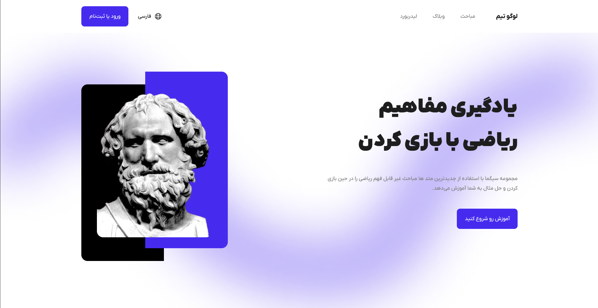
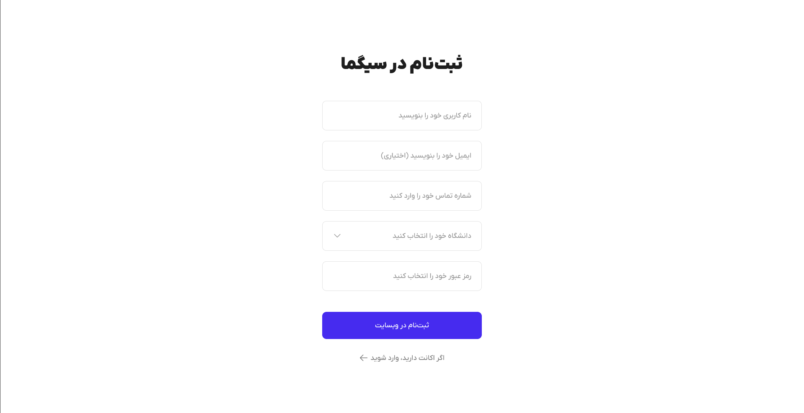
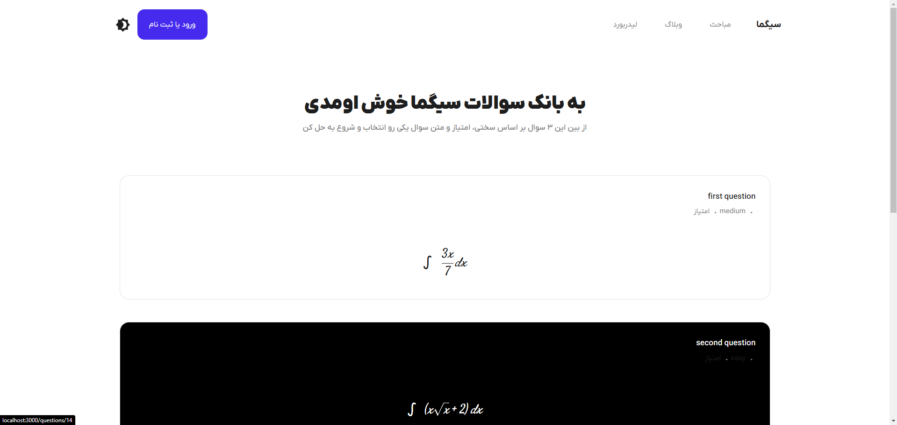
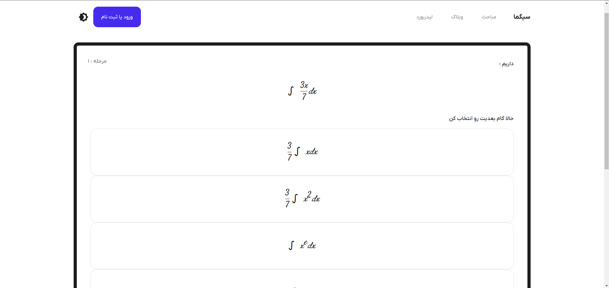

# **$\Sigma$ برنامه وب سیگما**

🌐 [English](README.md) | فارسی

🚀 **یادگیری بهتر، عمیق‌تر: جایی که علم با هیجان همراه می‌شود**

به مخزن **برنامه وب سیگما** خوش آمدید! این برنامه برای متحول کردن یادگیری طراحی شده است، به گونه‌ای که سرگرم‌کننده، جذاب و علمی بهینه باشد. وارد چالش‌های ریاضی و علوم دیگر شوید، آموزش‌ها را تماشا کنید، کتاب‌های الکترونیکی بخوانید و ذهن خود را به مرزهای جدید برسانید و بهره‌وری یادگیری خود را افزایش دهید.

---

## **فازها**

- ما در حال حاضر در **فاز ۱** هستیم.
- انتظار می‌رود در **روز اول سال ۲۰۲۵** وارد **فاز ۲** شویم.
- تعداد کل **فازها**؟ +۴ فاز، ایده‌ها در حال شکل‌گیری هستند، بنابراین محدودیتی وجود ندارد :D
- ما در ابتدا هستیم، پروژه هنوز عملیاتی نشده است (**فاز ۱ در مورد زیربناها است**).

**متاسفانه بدلیل انکه سرور های بک‌اند خاموش هستند امکان دسترسی به سوالات، داشبورد و احراز هویت**

---

## 🎯 **ویژگی‌های فعلی**

- **چالش‌های تعاملی**: حل مسائل ریاضی و علمی که برای آزمودن و بهبود مهارت‌های شما طراحی شده‌اند.
- **یادگیری تطبیقی**: سوالات بر اساس سطح مهارت شما تنظیم می‌شوند و با حالت **نقشه راه** چالش‌برانگیز و پاداش‌دهنده باقی می‌مانند.
- **افزایش یادگیری با دوپامین**: هنگام حل مسائل و صعود به **جدول رده‌بندی**، فوران تمرکز و پاداش ناشی از استرس را تجربه کنید.

---

## ⏳ **ویژگی‌های آینده**

- **دانشگاه در خانه**: آموزش‌های ویدیویی، کتاب‌های الکترونیکی، همه در یک مکان! استراحت کنید و یاد بگیرید.
- **حالت دوئل**: در زمان واقعی با دوستان یا سایر یادگیرندگان رقابت کنید.
- **موضوعات جامع**: یادگیری ریاضی، فیزیک، شیمی، زیست‌شناسی و بیشتر.
- **پیشرفت گیمیفیکیشن‌شده**: نشان‌ها کسب کنید، آمار خود را پیگیری کنید و دستاوردها را باز کنید.
- **منتظر باشید** زیرا بسیاری از ویژگی‌ها، واقعاً خیلی زیاد، در راه هستند و آنها را فاز به فاز معرفی خواهیم کرد.

---

## 🧪 **نحوه کار (فعلاً 😁)**

1. **موضوع خود را انتخاب کنید**: از بین موضوعات متنوع ریاضی یکی را انتخاب کنید. (علوم دیگر به زودی اضافه می‌شوند!)
2. **یک چالش را شروع کنید**: مجموعه‌ای زمان‌دار از سوالات را حل کنید.
3. **بازخورد دریافت کنید**: پاسخ‌های خود را مرور کنید، تکنیک‌های جدید یاد بگیرید و پیشرفت خود را پیگیری کنید.
4. **در جدول رده‌بندی بالا بروید**: با همتایان خود در سطح جهانی رقابت کنید و برای رسیدن به بالاترین رتبه تلاش کنید.

---

## 📱 **تصاویر**

در اینجا تصاویری از برنامه ارائه شده است:

---

## 🤝 **همکاران**

مطمئناً این پروژه بخش‌های دیگری مانند توسعه‌دهندگان بک‌اند، اندروید و تیم طراحی UI/UX دارد!

- [بک‌اند](https://github.com/mohammad2831/math/tree/master)
  - محمد مهدی جهانتیغی [⤴️](https://github.com/mohammad2831) - **سرگروه**
- [فرانت‌اند](https://github.com/TheOnlyDuke/Myth-Website)
  - مهدی عباسی [⤴️](https://github.com/TheOnlyDuke) - **سرگروه**
- [اندروید]()
  - یاسین قابوسی - **سرگروه**
- [طراحی (UI/UX)](https://Gwparsa.ir)
  - پارسا سورسوری [⤴️](https://gwparsa.ir) - **سرگروه**
  - مهدی عباسی [⤴️](https://github.com/TheOnlyDuke)

---

## 📜 **مجوز**

این پروژه تحت مجوز Apache License 2.0 منتشر شده است.

شما می‌توانید از این پروژه استفاده کنید، آن را تغییر دهید و توزیع کنید، به شرطی که شرایط مجوز را رعایت کنید. شرایط کلیدی عبارتند از:

- **اعتباردهی**: شما باید اعتبار مناسب به نویسندگان اصلی این پروژه بدهید.
- **بدون مسئولیت**: این پروژه "همان‌طور که هست" ارائه می‌شود و هیچ ضمانتی ندارد. نویسندگان هیچ مسئولیتی در قبال خسارات یا ادعاها ندارند.

متن کامل مجوز در فایل [LICENSE](LICENSE) موجود است.

برای جزئیات بیشتر درباره Apache License 2.0، به مستندات رسمی مراجعه کنید: [Apache License 2.0](https://www.apache.org/licenses/LICENSE-2.0).

