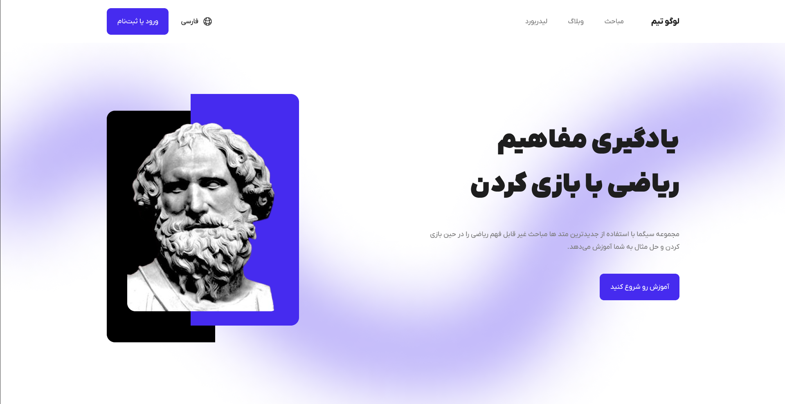
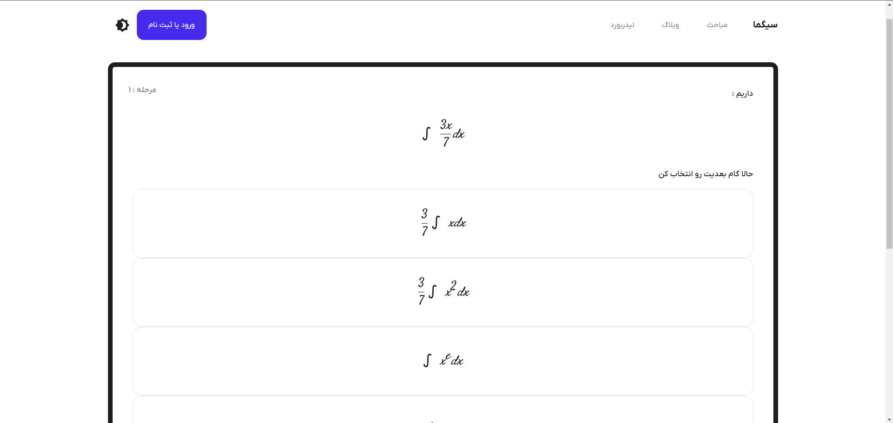

# **$\Sigma$ Sigma Web Application**

🌐 [فارسی](README.fa.md) | English

🚀 **Learn Better, Learn Deeper: Where Science Meets Excitement**

Welcome to the **Sigma Web Application** repository! This app is designed to revolutionize learning by making it fun, engaging, and scientifically optimized. Dive into math and other sciences challenges, watch tutorials, read Ebooks, and push your brain to new limits while boosting your learning efficiency.

## Phasing

- We are currently in **Phase 1**
- Expected to enter **Phase 2** in first day of 2025
- total number of **Phases** ? +4 Phases, ideas are coming in so yup there is no limit :D
- We are at the start, project is not operetional (**Phase 1 is all about foundemental**)

**Unfortunately Back-end server are down and do to that Questions, Authentication and Dashboard are not accessible**

## 🎯 Current Features

- **Interactive Challenges**: Solve math and science problems designed to test and improve your skills.
- **Adaptive Learning**: Questions adjust to your skill level, keeping it challenging and rewarding with **RoadMap mode**.
- **Boost with Dopamine**: Experience stress-induced bursts of focus and reward as you solve problems and climb the **leaderboard**.

## ⏳ Upcomming Features

- **University at home**: Watch tutorials, have EBooks all in one place! relax and learn
- **Dueling Mode**: Compete with friends or other learners in real-time duels.
- **Comprehensive Topics**: Learn math, physics, chemistry, biology, and more.
- **Gamified Progress**: Earn badges, track stats, and unlock achievements.
- **Sit tight** cause a lot i mean a lot are coming, they are on their way! we will reveal them phase by phase.

## 🧪 How It Works ( for now of course 😁 )

1. **Pick Your Topic**: Choose from a variety of math topics. (other sciences will be included soon!)
2. **Start a Challenge**: Tackle a timed set of questions.
3. **Get Feedback**: Review your answers, learn new techniques, and track your improvement.
4. **Climb the Ranks**: Compete with peers globally and strive for the top spot.

## 📱 Screenshots

Here are some screenshots to give you a glimpse of the app:

## 🤝 Partners

Surely this project has other parts like Back-end, android developers and UI/UX Designer team!

- [Back-End](https://github.com/mohammad2831/math/tree/master)
  - Mohammad Mahdi Jahan Tighi [⤴️](https://github.com/mohammad2831) - **Leader**
- [Front-End]()
  - Duke [⤴️](https://github.com/TheOnlyDuke) - **Leader**
- [Android]()
  - Yasin Ghabousi [⤴️]() -**Leader**
- Desgin(UI/UX)
  - Gwparsa [⤴️](https://gwparsa.ir) - **Leader**
  - Duke [⤴️](https://github.com/TheOnlyDuke)

## 📜 License

This project is licensed under the Apache License 2.0.

You are free to use, modify, and distribute this project, provided you comply with the terms of the license. Key terms include:

- **Attribution**: You must give appropriate credit to the original authors of this project.
- **No Liability**: This project is provided "as is" without any warranties, and the authors are not liable for any damages or claims.

You can find the full license text in the [LICENSE](LICENSE) file.

For more details about the Apache License 2.0, visit the official documentation: [Apache License 2.0](https://www.apache.org/licenses/LICENSE-2.0).
